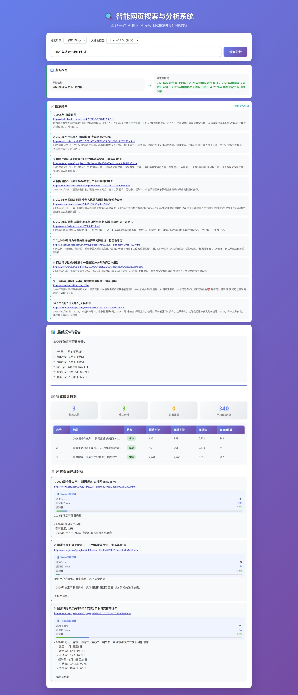

# AutoWebSearch

一个基于 **LangGraph 多 Agent 协同** 和 LangChain 框架的智能网页搜索与分析系统。采用多 Agent 协作架构，通过不同功能的 Agent 协同工作，自动完成网页搜索、内容分析和结果汇总。

[English](README_en.md) | 简体中文

## 功能特点

- **多 Agent 协同架构** - 基于 LangGraph 的工作流编排，多个 Agent 各司其职、协同工作
  - 查询改写 Agent：优化用户查询，提升搜索精准度
  - 搜索执行 Agent：调用搜索引擎获取相关网页
  - 内容分析 Agent：逐页分析网页内容，提取关键信息
  - 结果汇总 Agent：综合分析结果，生成结构化结论
- **多搜索引擎支持** - 支持百度、必应两大搜索引擎
- **智能网页抓取** - 自动访问并提取搜索结果网页内容
- **本地 AI 分析** - 使用本地 OLLAMA 模型进行智能内容分析
- **实时进度展示** - WebSocket 实时推送分析进度
- **结构化结果** - 汇总多个网页分析，提供清晰的结论
- **可视化界面** - 友好的 Web UI，操作简单直观
- **Token 统计** - 实时显示每个页面的 Token 消耗和压缩比

## 界面预览



## 技术栈

- **Python 3.10+** - 主要编程语言
- **LangChain & LangGraph** - Agent 工作流编排
- **FastAPI** - Web 服务框架
- **Ollama** - 本地 LLM 推理
- **BeautifulSoup4** - 网页内容解析
- **pytest** - 单元测试框架

## 快速开始

### 环境要求

- Python 3.10 或更高版本
- 已安装并运行 OLLAMA 服务
- 支持的模型：Llama3.2:3b, Qwen3.5:2b 等

### 1. 克隆项目

```bash
git clone https://github.com/yourusername/AutoWebSearch.git
cd AutoWebSearch
```

### 2. 安装依赖

```bash
pip install -r requirements.txt
```

### 3. 安装并启动 OLLAMA

参考 [OLLAMA 官网](https://ollama.ai/) 安装 OLLAMA，然后拉取所需的模型：

```bash
# 启动 OLLAMA 服务
ollama serve

# 拉取模型（根据需要选择）
ollama pull llama3.2:3b
ollama pull qwen3.5:2b
```

### 4. 启动服务

```bash
python app.py
```

服务启动后，在浏览器中访问 `http://localhost:8000` 即可使用。

## 项目结构

```
AutoWebSearch/
├── src/
│   ├── __init__.py
│   ├── search_engine/           # 搜索引擎模块
│   │   ├── __init__.py
│   │   ├── baidu_search.py     # 百度搜索
│   │   └── bing_search.py       # 必应搜索
│   ├── web_scraper/            # 网页爬取模块
│   │   ├── __init__.py
│   │   └── scraper.py          # 网页内容提取
│   ├── llm/                    # LLM 集成模块
│   │   ├── __init__.py
│   │   └── ollama_client.py    # Ollama 客户端
│   └── graph/                  # LangGraph 工作流
│       ├── __init__.py
│       └── agent_graph.py      # Agent 工作流定义
├── static/
│   └── index.html              # Web 界面
├── tests/                      # 测试用例
│   ├── test_baidu_search.py
│   ├── test_bing_search.py
│   ├── test_web_scraper.py
│   └── test_ollama_client.py
├── docs/
│   └── Example.jpeg            # 界面截图
├── app.py                      # Web 服务入口
├── main.py                     # 命令行入口
├── requirements.txt            # 项目依赖
├── .gitignore
└── README.md
```

## 使用方法

### Web 界面使用

1. 选择搜索引擎（百度/必应）
2. 选择 LLM 模型
3. 输入搜索关键词
4. 点击「搜索分析」按钮
5. 实时查看分析进度和结果

### 命令行使用

```bash
# 使用百度搜索
python main.py "人工智能的最新发展趋势" --engine baidu

# 使用必应搜索
python main.py "Python 异步编程教程" --engine bing

# 指定模型
python main.py "机器学习基础" --model qwen3.5:2b
```

## 工作流程

```
用户输入查询
     │
     ▼
┌─────────────────┐
│  查询改写优化    │
└─────────────────┘
     │
     ▼
┌─────────────────┐
│  搜索引擎检索    │
│  (最多20个结果)  │
└─────────────────┘
     │
     ▼
┌─────────────────┐
│  逐个分析网页    │
│  - 抓取内容     │
│  - LLM 分析     │
│  - Token 统计   │
└─────────────────┘
     │
     ▼
┌─────────────────┐
│  综合结论汇总    │
└─────────────────┘
     │
     ▼
   结果展示
```

## 运行测试

```bash
# 运行所有测试
python -m pytest tests/ -v

# 运行特定模块测试
python -m pytest tests/test_baidu_search.py -v
python -m pytest tests/test_bing_search.py -v
```

## 配置说明

### 修改默认模型

编辑 `app.py` 中的默认模型配置：

```python
llm_model = data.get("llm_model", "llama3.2:3b")
```

### 修改检索数量

检索数量已硬编码为 20 个结果，如需修改请编辑 `app.py`：

```python
num_results = 20  # 固定为20
```

### 修改 OLLAMA 地址

编辑 `src/llm/ollama_client.py`：

```python
llm_client = OllamaClient(
    model='llama3.2:3b',
    base_url='http://localhost:11434'  # OLLAMA 服务地址
)
```

## 注意事项

- 确保 OLLAMA 服务已正常启动并运行
- 首次运行需要等待模型加载（时间取决于模型大小）
- 网络环境会影响搜索和网页抓取的速度
- 建议在良好的网络环境下使用以获得最佳体验

## 贡献

欢迎提交 Issue 和 Pull Request！

## 许可证

本项目采用 MIT 许可证 - 详见 [LICENSE](LICENSE) 文件

## Star History

[](https://star-history.com/water668/AutoWebSearch&Timeline)
